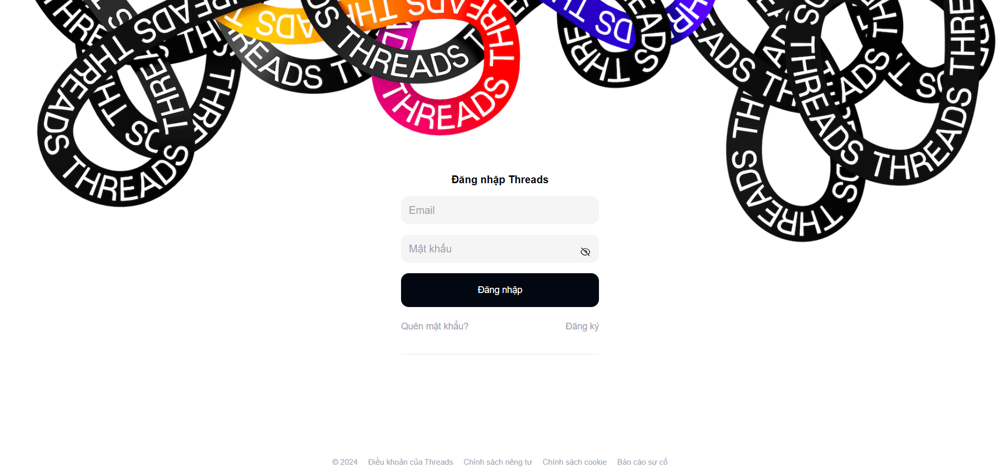
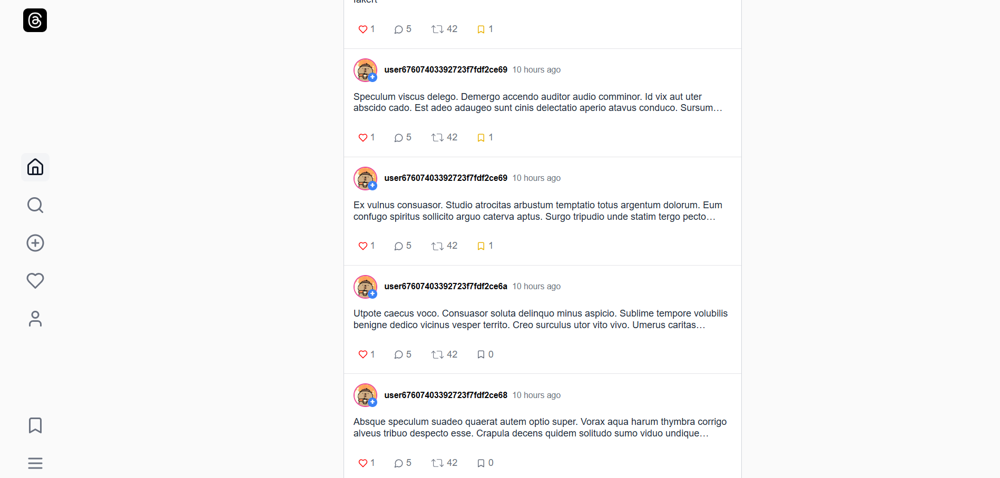
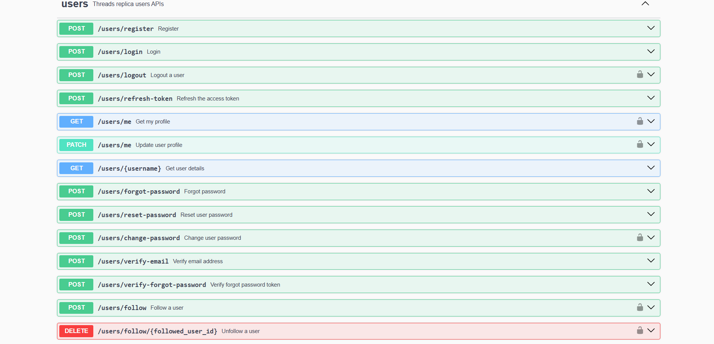

# Threads Replica

### 🚀 Inspire from Threads - a social network

## 🌐 Website

_(in progress)_



## 📄 API Documentation

- **Public API**: [Threads API Docs](https://threads-replica-5n8l.onrender.com/api-docs)
- **Localhost**: [localhost:4000/api](http://localhost:4000/api-docs/)
  

## 🛠️ Tech Stack

### Frontend

- TypeScript, ReactJS
- Axios, TanStack Query
- RadixUI, TailwindCSS

### Backend

- Node.js, Express.js
- MongoDB, Swagger

### Cloud Services

- AWS S3 (Storage)
- AWS SES (Email Service)
- MongoDB Atlas (Database)

### Deployment

- **Frontend**: Vercel
- **Backend**: Render

## 💻 Run Locally

### 1️⃣ Clone the project

```bash
git clone https://github.com/hanguyentieuyen/threads-replica.git
```

### 2️⃣ Run the Frontend

```bash
cd threads-web
yarn install
yarn dev
```

### 3️⃣ Run the Backend

```bash
cd threads-api
npm install
```

#### 3.1️⃣ Configure Environment Variables

Copy the example env file and update the required variables:

```bash
cp .env.example .env
```

Edit the `.env` file and set up your database connection, AWS credentials, and other configurations.

#### 3.2️⃣ Start the backend server

```bash
npm run dev
```

💡 **Made with ❤️ by [hanguyentieuyen](https://github.com/hanguyentieuyen)**
