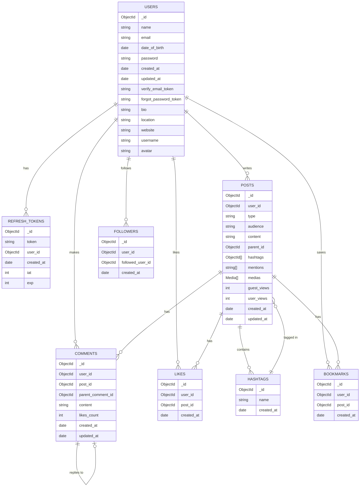

```mermaid
erDiagram
    USERS {
        ObjectId _id
        string name
        string email
        date date_of_birth
        string password
        date created_at
        date updated_at
        string verify_email_token
        string forgot_password_token
        string bio
        string location
        string website
        string username
        string avatar
    }
    REFRESH_TOKENS {
        ObjectId _id
        string token
        ObjectId user_id
        date created_at
        int iat
        int exp
    }
    POSTS {
        ObjectId _id
        ObjectId user_id
        string type
        string audience
        string content
        ObjectId parent_id
        ObjectId[] hashtags
        string[] mentions
        Media[] medias
        int guest_views
        int user_views
        date created_at
        date updated_at
    }
    COMMENTS {
        ObjectId _id
        ObjectId user_id
        ObjectId post_id
        ObjectId parent_comment_id
        string content
        int likes_count
        date created_at
        date updated_at
    }
    LIKES {
        ObjectId _id
        ObjectId user_id
        ObjectId post_id
        date created_at
    }
    HASHTAGS {
        ObjectId _id
        string name
        date created_at
    }
    FOLLOWERS {
        ObjectId _id
        ObjectId user_id
        ObjectId followed_user_id
        date created_at
    }
    BOOKMARKS {
        ObjectId _id
        ObjectId user_id
        ObjectId post_id
        date created_at
    }

    USERS ||--o{ REFRESH_TOKENS : "has"
    USERS ||--o{ POSTS : "writes"
    USERS ||--o{ COMMENTS : "makes"
    USERS ||--o{ LIKES : "likes"
    USERS ||--o{ FOLLOWERS : "follows"
    USERS ||--o{ BOOKMARKS : "saves"

    POSTS ||--o{ COMMENTS : "has"
    POSTS ||--o{ LIKES : "has"
    POSTS ||--o{ BOOKMARKS : "has"

    COMMENTS ||--o| COMMENTS : "replies to"

    POSTS ||--o{ HASHTAGS : "contains"
    HASHTAGS ||--o{ POSTS : "tagged in"

```
