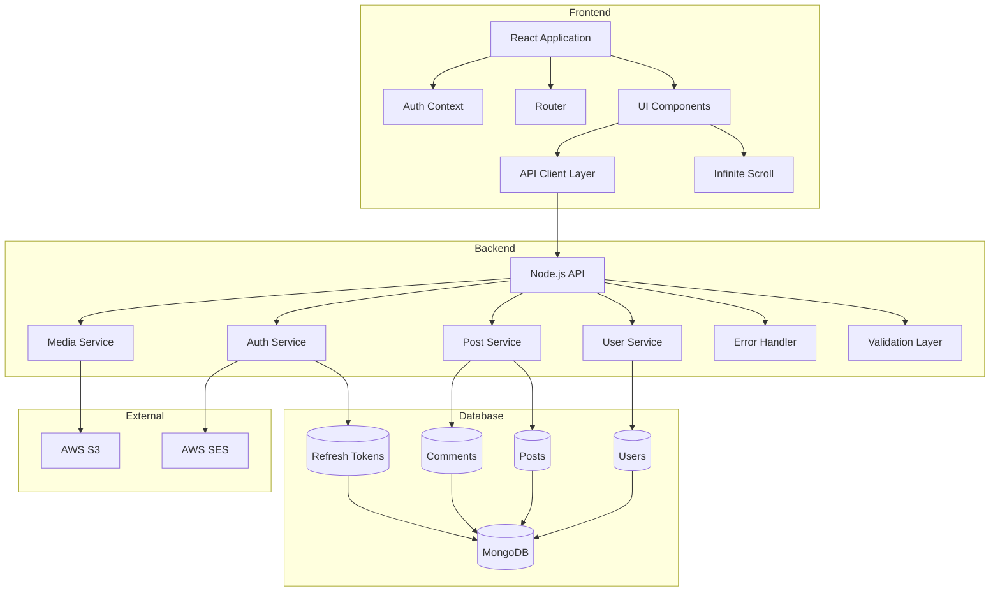

```mermaid
graph TB
    subgraph Frontend
        ReactApp["React Application"]
        AuthContext["Auth Context"]
        APIClient["API Client Layer"]
        Router["Router"]
        Components["UI Components"]
        InfiniteScroll["Infinite Scroll"]
    end

    subgraph Backend
        NodeAPI["Node.js API"]
        AuthService["Auth Service"]
        UserService["User Service"]
        PostService["Post Service"]
        MediaService["Media Service"]
        ErrorHandler["Error Handler"]
        Validation["Validation Layer"]
    end

    subgraph Database
        MongoDB[(MongoDB)]
        UserCollection[(Users)]
        PostCollection[(Posts)]
        CommentCollection[(Comments)]
        TokenCollection[(Refresh Tokens)]
    end

    subgraph External
        AWSS3["AWS S3"]
        AWSSES["AWS SES"]
    end

    %% Frontend Flow
    ReactApp --> AuthContext
    ReactApp --> Router
    ReactApp --> Components
    Components --> InfiniteScroll
    Components --> APIClient

    %% API Communication
    APIClient --> NodeAPI

    %% Backend Services
    NodeAPI --> AuthService
    NodeAPI --> UserService
    NodeAPI --> PostService
    NodeAPI --> MediaService
    NodeAPI --> ErrorHandler
    NodeAPI --> Validation

    %% Database Interactions
    UserService --> UserCollection
    PostService --> PostCollection
    AuthService --> TokenCollection
    PostService --> CommentCollection

    %% External Service Integration
    MediaService --> AWSS3
    AuthService --> AWSSES

    %% Data Flow
    UserCollection --> MongoDB
    PostCollection --> MongoDB
    CommentCollection --> MongoDB
    TokenCollection --> MongoDB
```
