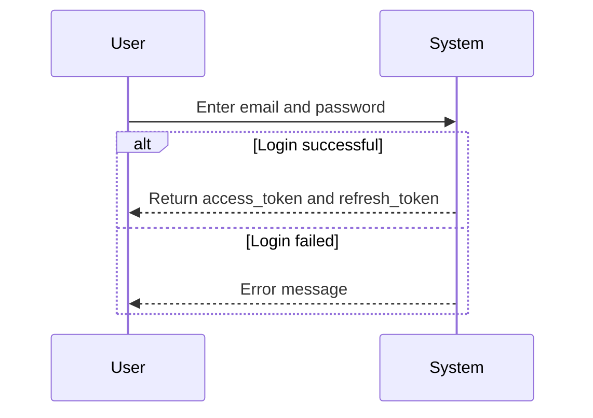
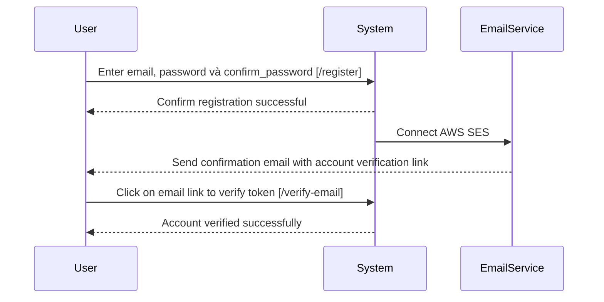
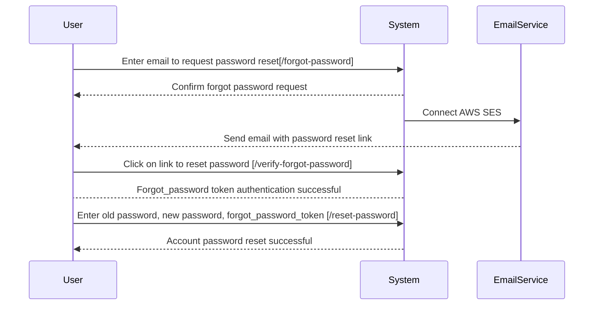

# User Authentication Flow

## 1. User Login Flow

```mermaid
sequenceDiagram
    participant User
    participant System

    User->>System: Enter email and password
    alt Login successful
        System-->>User: Return access_token and refresh_token
    else Login failed
        System-->>User: Error message
    end
```

## 2. User Registration Flow

```mermaid
sequenceDiagram
    participant User
    participant System
    participant EmailService

    User->>System: Enter email, password và confirm_password [/register]
    System-->>User: Confirm registration successful
    System->>EmailService: Connect AWS SES
    EmailService-->>User: Send confirmation email with account verification link
    User->>System: Click on email link to verify token [/verify-email]
    System-->>User: Account verified successfully
```

## 3. Forgot Password Flow

```mermaid
sequenceDiagram
    participant User
    participant System
    participant EmailService

    User->>System: Enter email to request password reset[/forgot-password]
    System-->>User: Confirm forgot password request
    System->>EmailService: Connect AWS SES
    EmailService-->>User: Send email with password reset link
    User->>System: Click on link to reset password [/verify-forgot-password]
    System-->User: Forgot_password token authentication successful
    User->>System: Enter old password, new password, forgot_password_token [/reset-password]
    System-->>User: Account password reset successful
```
